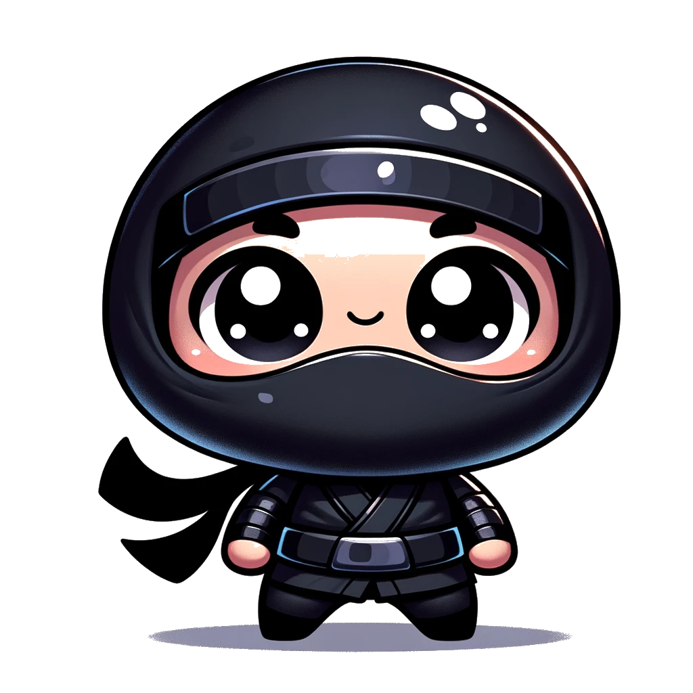

# Ninjas Gallery
This repository contains an example of a simple HTML page displaying a gallery of ninja images with a styled background using CSS.

## Contents

**index.html:** The main HTML file containing the structure of the webpage.
**style.css:** The CSS file containing the styles for the ninja images and background.
**img/:** Directory containing the images used in the webpage.

**Usage:*

To view the ninja gallery, open the index.html file in a web browser. Ensure that the images and CSS file are in the correct directories as specified.

## Files
**-index.html**
This file contains the HTML structure for the webpage, including four images of ninjas within a div container.

```html
<!DOCTYPE html>
<html lang="en">
    <head>
        <meta charset="UTF-8" />
        <meta name="viewport" content="width=device-width, initial-scale=1.0" />
        <title>Ninjas</title>
        <link rel="stylesheet" href="style.css" />
    </head>
    <body>
        <div id="dojo">
            
            
            
            
        </div>
    </body>
</html>
```

**-style.css**
This file contains the CSS styles for the dojo container and the ninja images. It sets the background image, sizes, and positioning of the elements.

```css
#dojo {
    width: 400px;
    height: 200px;
    background-image: url(img/background.png);
    background-size: cover;
    display: flex;
    align-items: flex-end;
    justify-content: space-between;
    position: absolute;
}

img {
    width: 50px;
    height: 50px;
    margin: 0 10px;
}
```
## Directory Structure
Ensure the following directory structure for the files:

```css
project-root/
├── index.html
├── style.css
└── img/
    ├── background.png
    ├── blue.png
    ├── green.png
    ├── black.png
    └── red.png
```